# Grafana Dashboards

Colección seleccionada de tableros de Grafana listos para usar. Cada tablero incluye un enlace a su entrada en Grafana.com (cuando está disponible), imágenes de vista previa y una subcarpeta con el JSON que puedes importar directamente en Grafana.

# Dashboards

## AKS Container Insights
- Detalles y configuración: [./aks-pods-az-monitor/README.md](./aks-pods-az-monitor/README.md)  
- ID de Galería: `12180`  
- Enlace de Galería: https://grafana.com/grafana/dashboards/12180-aks-container-insights/  
- Descargas: 992,227

Vista previa:
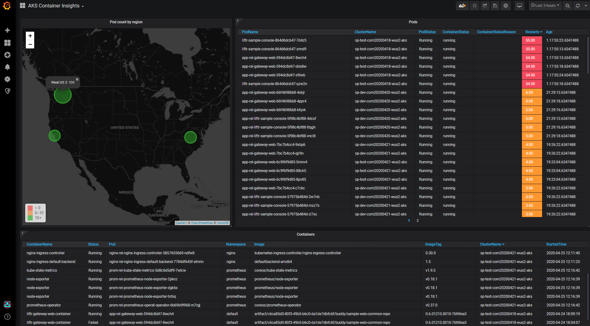

---

## Claude Code
- Detalles y configuración: [./claude-code/README.md](./claude-code/README.md)

Vista previa:
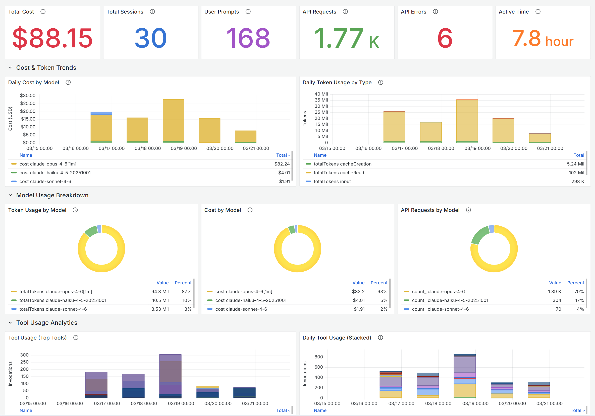

---

## Codex
- Detalles y configuración: [./codex/README.md](./codex/README.md)

Vista previa:
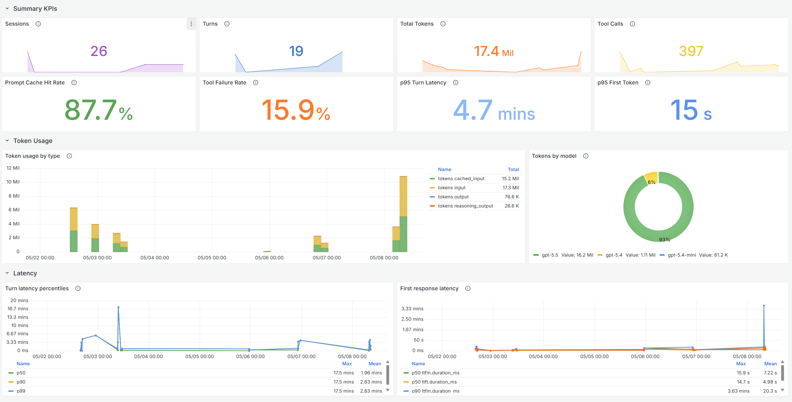

---

## GitHub Copilot
- Detalles y configuración: [./github-copilot/README.md](./github-copilot/README.md)

Vista previa:
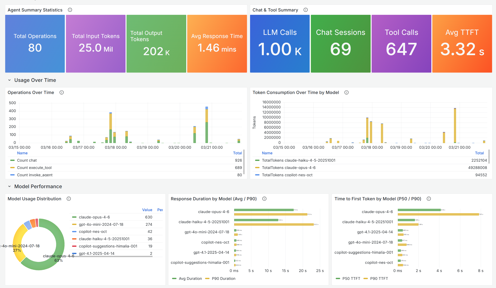

---

## OpenClaw
- Detalles y configuración: [./openclaw/README.md](./openclaw/README.md)

Vista previa:
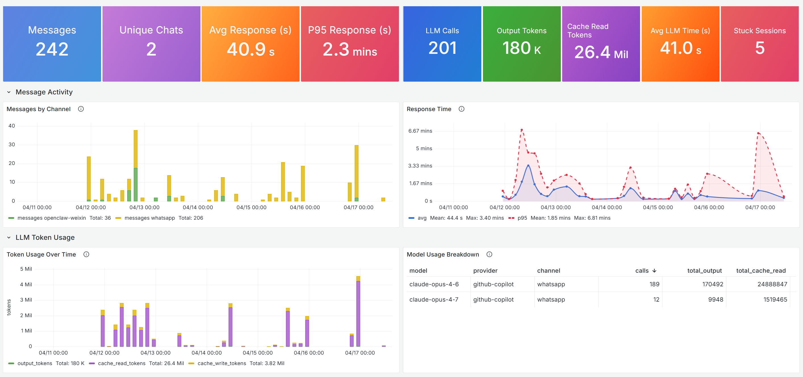

---

## OpenCode
- Detalles y configuración: [./opencode/README.md](./opencode/README.md)

Vista previa:
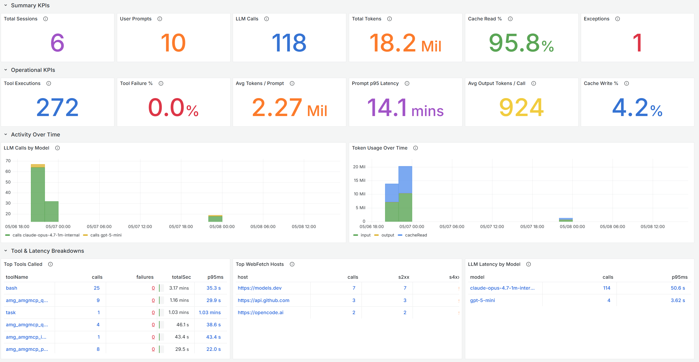

---

## Gemini CLI
- Detalles y configuración: [./gemini-cli/README.md](./gemini-cli/README.md)

Vista previa:
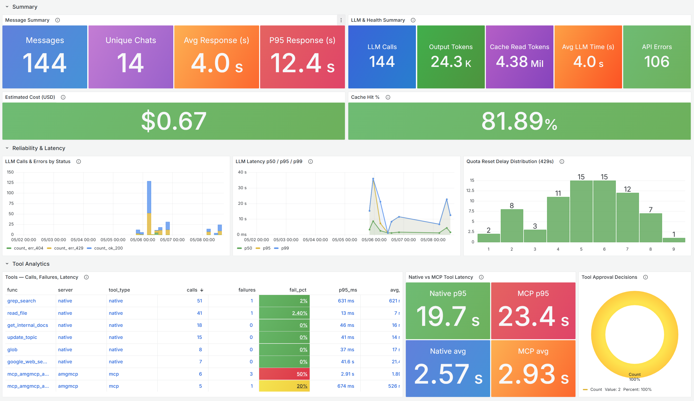

---

## Azure AI Foundry
- Detalles y configuración: [./ai-foundry/README.md](./ai-foundry/README.md)  
- ID de Galería: `24039`  
- Enlace de Galería: https://grafana.com/grafana/dashboards/24039-ai-foundry/

Vistas previas:
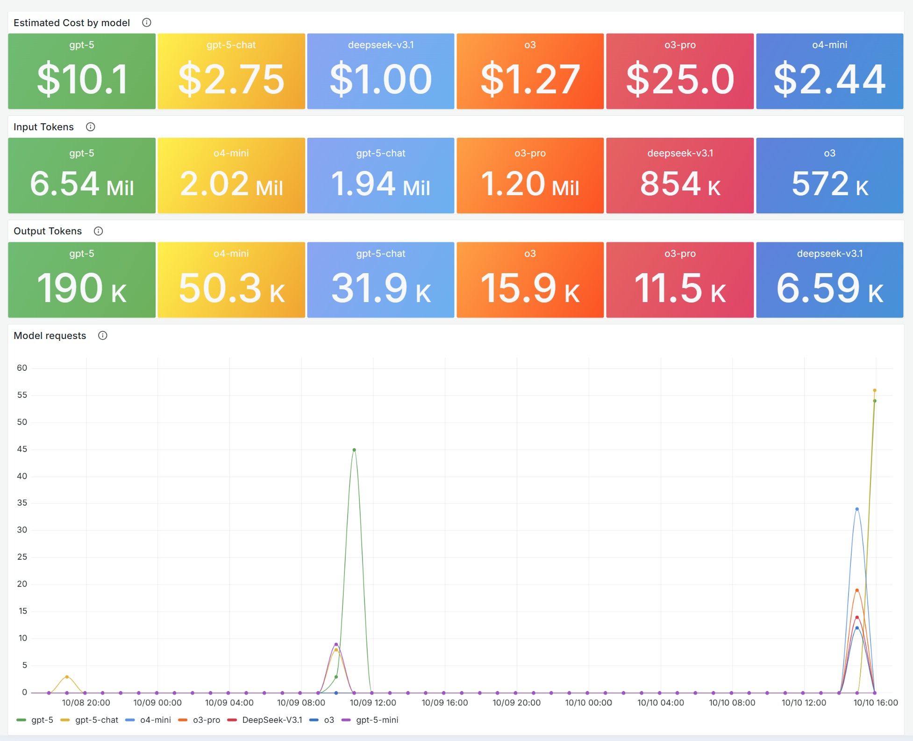
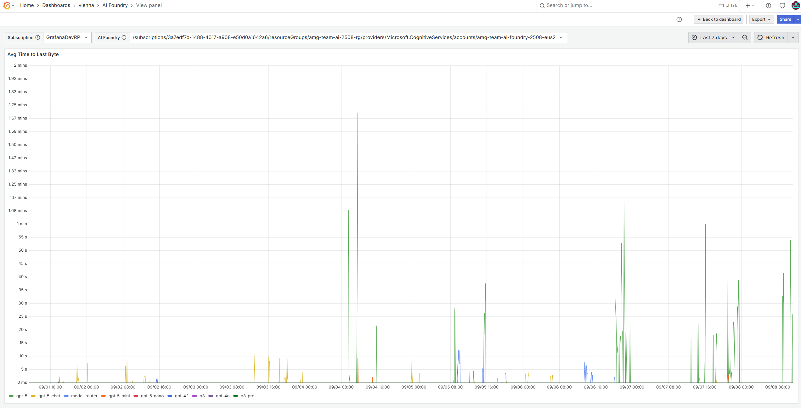

---

## Agent Framework - Agent Overview
- Detalles y configuración: [./agent-framework/README.md](./agent-framework/README.md)  
- ID de Galería: `24156`  
- Enlace de Galería: https://grafana.com/grafana/dashboards/24156-agent-framework/

Vistas previas:

---

## Agent Framework - Workflow Overview
- Detalles y configuración: [./af-workflow/README.md](./af-workflow/README.md)  
- ID de Galería: `24176`  
- Enlace de Galería: https://grafana.com/grafana/dashboards/24176-agent-framework-workflow/

Vistas previas:

---

## LiteLLM
- Detalles y configuración: [./litellm-azmon/README.md](./litellm-azmon/README.md)  
- ID de Galería: `24055`  
- Enlace de Galería: https://grafana.com/grafana/dashboards/24055-litellm/

Vistas previas:
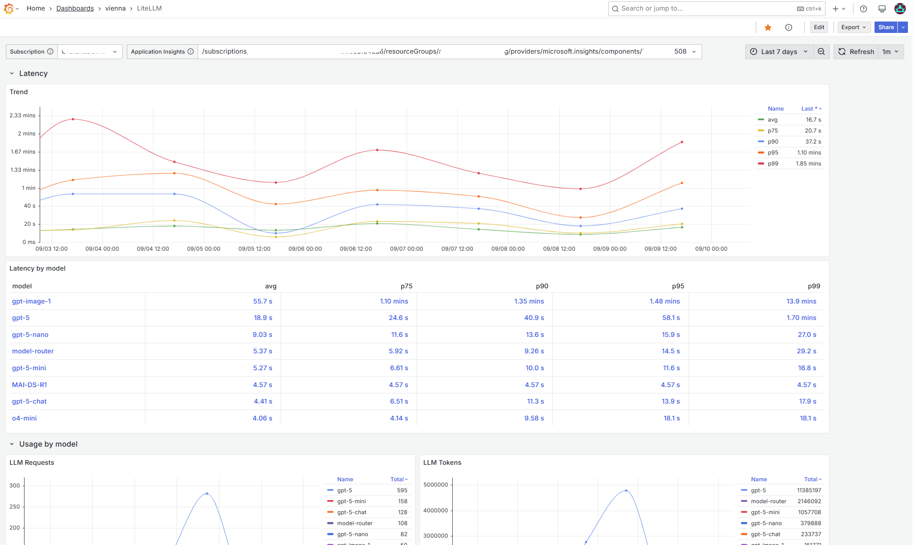
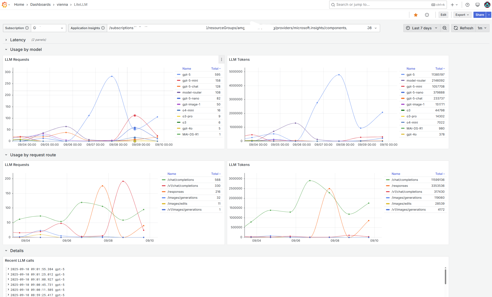
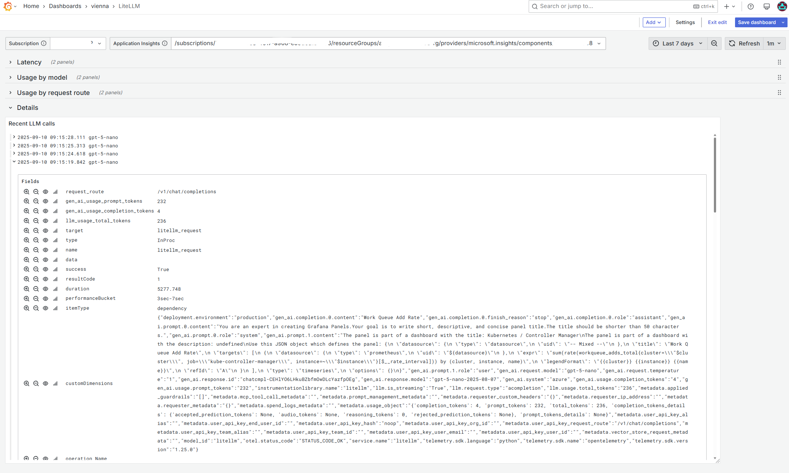

---

## LiteLLM Trace Details
- Detalles y configuración: [./litellm-trace/README.md](./litellm-trace/README.md)  
- ID de Galería: `24064`  
- Enlace de Galería: https://grafana.com/grafana/dashboards/24064-litellm-trace-details/

Vistas previas:
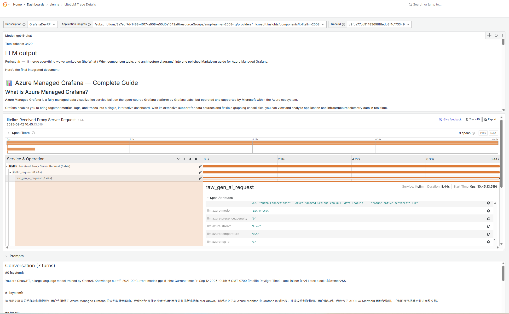
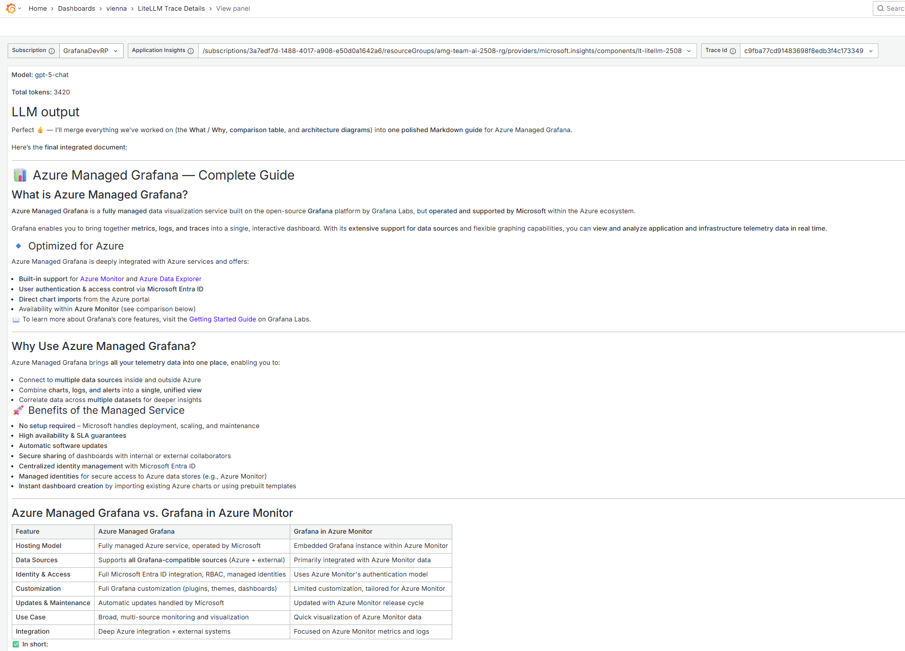
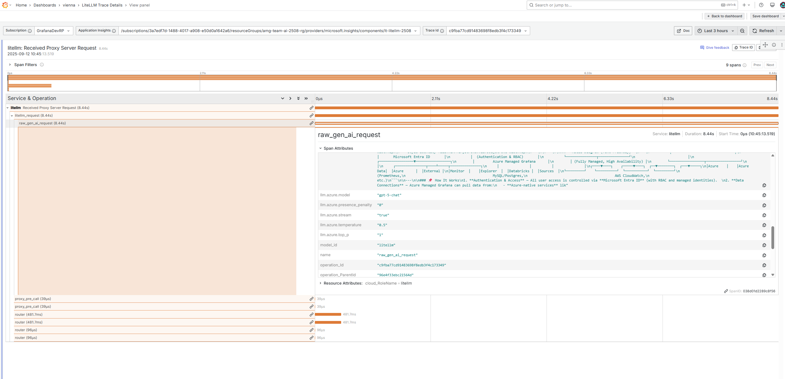
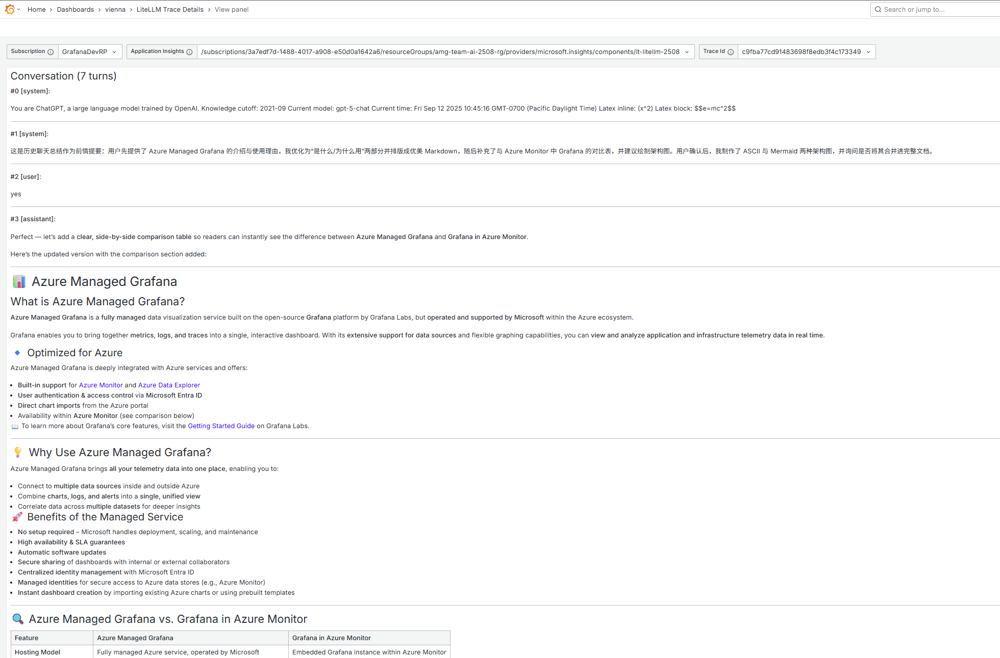

---

# Primeros Pasos

Puedes importar estos tableros en Grafana de dos maneras:

1) Importar por ID de Grafana.com  
- En Grafana, ve a Dashboards > New > Import  
- Ingresa uno de los IDs a continuación y haz clic en Load  
  - AKS Container Insights: `12180`  
  - Azure AI Foundry: `24039`  
  - LiteLLM: `24055`  

2) Importar desde JSON en este repositorio  
- En Grafana, ve a Dashboards > New > Import  
- Haz clic en "Upload JSON file" y elige el JSON del tablero:
  - `./aks-pods-az-monitor/dashboards/aks-pods-az-mon.json`
  - `./ai-foundry/dashboards/ai-foundry.json`
  - `./litellm-azmon/dashboards/litellm-azmon.json`
  - `./litellm-trace/dashboards/litellm-trace.json`
  - `./claude-code/dashboards/claude-code.json`
  - `./codex/dashboards/codex.json`
  - `./github-copilot/dashboards/github-copilot.json`
  - `./openclaw/dashboards/openclaw.json`
  - `./opencode/dashboards/opencode.json`
  - `./gemini-cli/dashboards/gemini-cli.json`

Nota: Algunos tableros requieren fuentes de datos específicas (por ejemplo, Azure Monitor). Asegúrate de que las fuentes de datos correspondientes estén configuradas en Grafana para que los paneles se pueblen correctamente.

# Ingesta de Datos

Varios tableros — **Claude Code**, **Codex**, **GitHub Copilot**, **OpenClaw**, **OpenCode** y **Gemini CLI** — dependen de la telemetría de Application Insights ingerida a través de OpenTelemetry. Consulta [Dashboard Data Ingestion](https://github.com/1w2w3y/grafana-dashboards/blob/master/data-ingestion.md) para conocer el flujo completo: configuración del OpenTelemetry Collector con el Azure Monitor Exporter, configuración OTLP por aplicación y verificación.

## Licencia

Este repositorio está licenciado bajo la [MIT License](./LICENSE).
