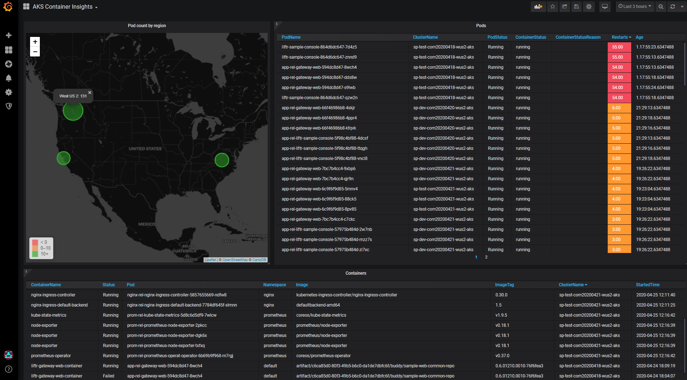
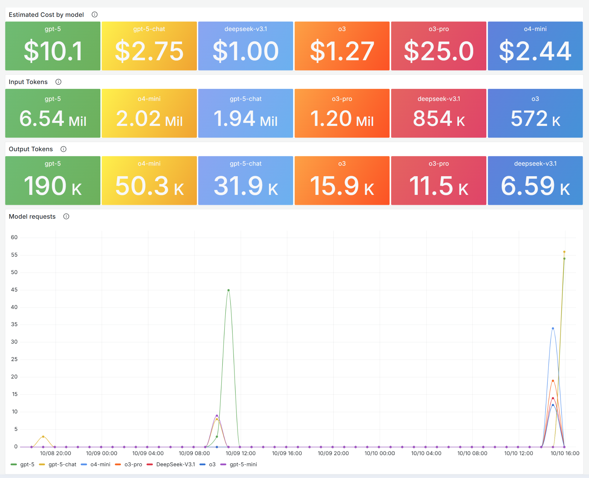
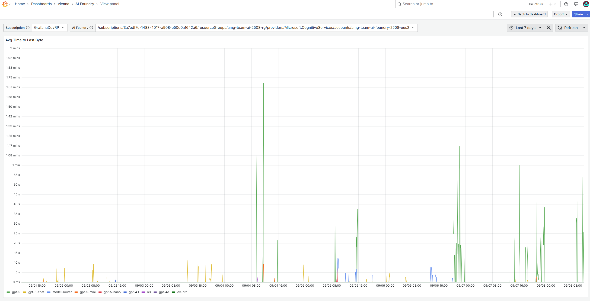
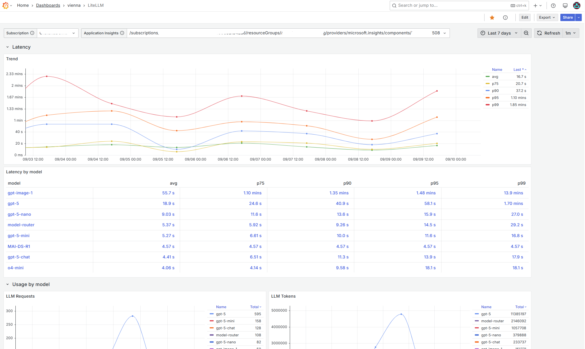
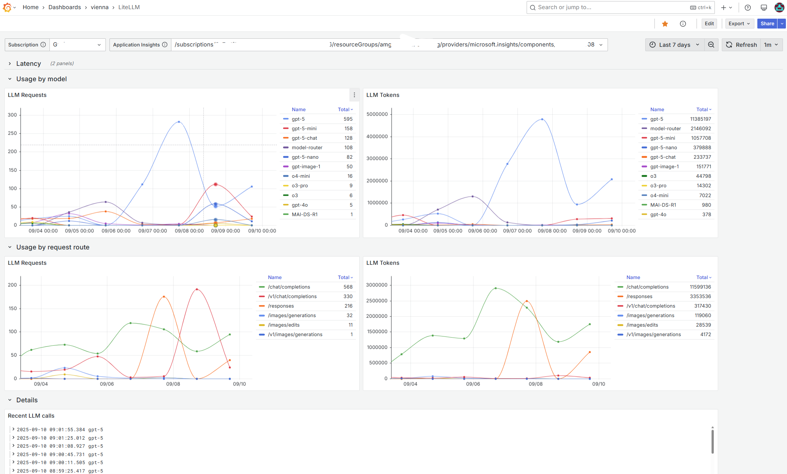
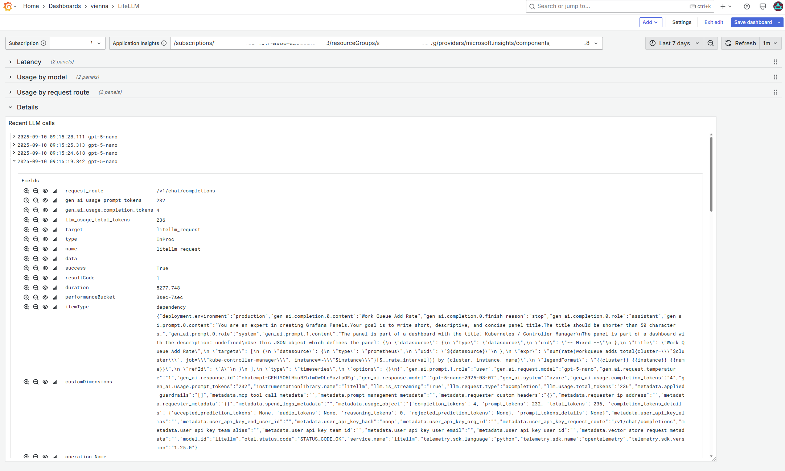
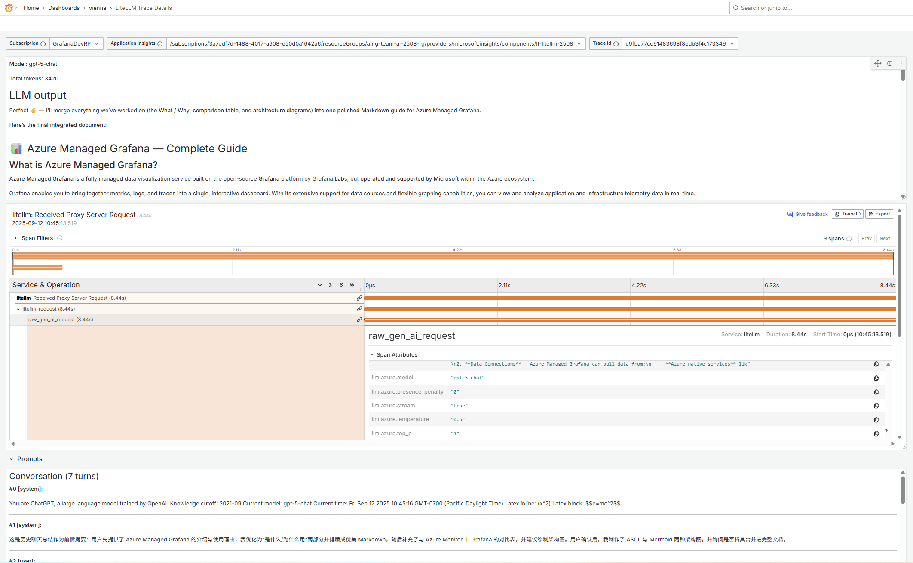
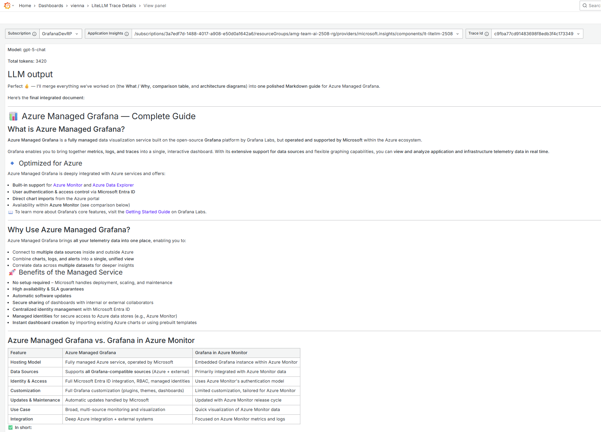
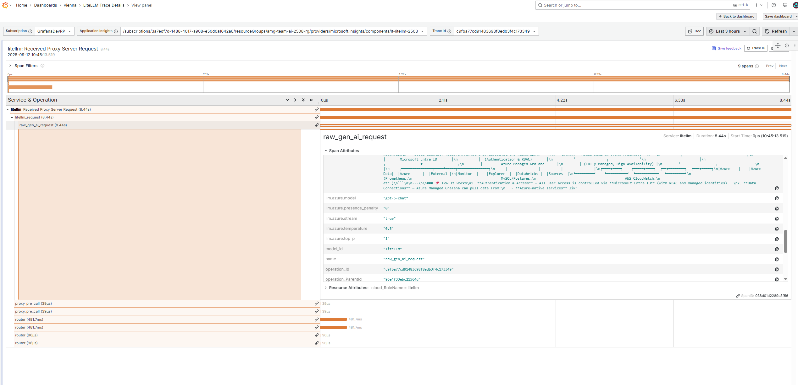
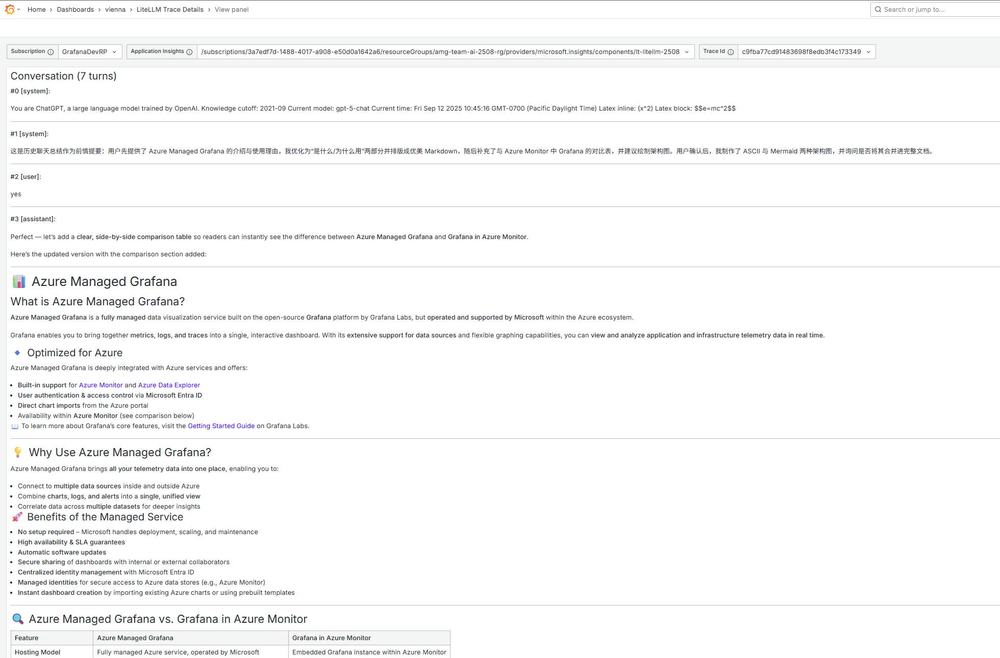

# Grafana Dashboards

Curated collection of ready-to-use Grafana dashboards. Each dashboard includes a link to its Grafana.com entry (when available), preview images, and a sub-folder with the JSON you can import directly into Grafana.

# Dashboards

## AKS Container Insights
- Details and setup: [./aks-pods-az-monitor/README.md](./aks-pods-az-monitor/README.md)  
- Gallery ID: `12180`  
- Gallery link: https://grafana.com/grafana/dashboards/12180-aks-container-insights/  
- Downloads: 992,227

Preview:

---

## Azure AI Foundry
- Details and setup: [./ai-foundry/README.md](./ai-foundry/README.md)  
- Gallery ID: `24039`  
- Gallery link: https://grafana.com/grafana/dashboards/24039-ai-foundry/

Previews:

---

## Agent Framework - Agent Overview
- Details and setup: [./agent-framework/README.md](./agent-framework/README.md)  
- Gallery ID: `24156`  

Previews:

---

## Agent Framework - Workflow Overview
- Details and setup: [./af-workflow/README.md](./af-workflow/README.md)  
- Gallery ID: `24176`  

Previews:

---

## LiteLLM
- Details and setup: [./litellm-azmon/README.md](./litellm-azmon/README.md)  
- Gallery ID: `24055`  
- Gallery link: https://grafana.com/grafana/dashboards/24055-litellm/

Previews:

---

## LiteLLM Trace Details
- Details and setup: [./litellm-trace/README.md](./litellm-trace/README.md)  
- Gallery ID: `24064`  
- Gallery link: https://grafana.com/grafana/dashboards/24064-litellm-trace-details/

Previews:

---

# Getting Started

You can import these dashboards into Grafana in two ways:

1) Import by Grafana.com ID  
- In Grafana, go to Dashboards > New > Import  
- Enter one of the IDs below and click Load  
  - AKS Container Insights: `12180`  
  - Azure AI Foundry: `24039`  
  - LiteLLM: `24055`  

2) Import from JSON in this repository  
- In Grafana, go to Dashboards > New > Import  
- Click "Upload JSON file" and choose the dashboard JSON:
  - `./aks-pods-az-monitor/dashboards/aks-pods-az-mon.json`
  - `./ai-foundry/dashboards/ai-foundry.json`
  - `./litellm-azmon/dashboards/litellm-azmon.json`
  - `./litellm-trace/dashboards/litellm-trace.json`

Note: Some dashboards expect specific data sources (for example, Azure Monitor). Ensure the corresponding data sources are configured in Grafana for the panels to populate correctly.

## License

This repository is licensed under the [MIT License](./LICENSE).
